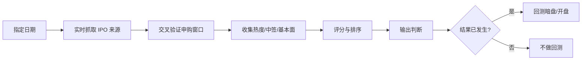

# 港股打新skill （hk ipo skill）


一个用于 **港股打新信息收集、交叉验证、评分和复盘** 的 skill。

它不是只看一个孖展倍数就给结论，而是每次调用时重新抓取实时网页信息，综合申购窗口、热度倍数、中签难度、同期相对热度、公司基本面、估值、AH/双重上市情况和市场情绪，给出一个可解释的打新辅助判断。

## 一句话安装

在 Codex 里发送：

```text
请从这个仓库安装 Codex skill：
https://github.com/caroline-li-studio/hk-ipo-skill

请把完整技能文件夹安装到我的 skills 目录中。
不要只复制 SKILL.md。
```


## 你会得到什么

- 查询某个日期或今天仍可申购的港股新股
- 多来源交叉确认招股日期、截止时间、发行价、入场费和上市日期
- 收集孖展倍数、公开认购倍数、一手中签率、预测中签或配发信息
- 比较同期 IPO 的相对热度，而不是孤立看单个倍数
- 分析公司基本面、行业、盈利能力、基石投资者、估值和 AH/双重上市情况
- 给每只可打新股票打分、评级和排序
- 对已经上市的历史案例做暗盘、开盘、首日表现回测

## 怎么工作



## 输出通常包含

| 模块 | 内容 |
| --- | --- |
| 一句话结论 | 当天有多少只可打新，以及优先关注哪只 |
| 排名表 | 代码、名称、申购窗口、入场费、热度倍数、中签难度、基本面备注、评分 |
| 逐股分析 | 正面因素、风险、估值/AH/可比公司、来源信心 |
| 排除项 | 当天上市但不可申购、已经截止或容易混淆的股票 |
| 回测 | 只对已经发生暗盘/上市结果的历史案例输出 |

## 示例提示词

```text
今天有哪些港股可以打新？按 skill 的格式给我评分。
```

```text
2026年7月2日有哪些港股可以打新？收集信息、排序，并说明中签难度。
```

```text
用 2026年6月1日的 case 做一次预测，并和真实暗盘、开盘表现回测。
```

## 数据原则

- 每次调用都重新 fetch 最新或当日网页来源
- 至少尽量使用两个独立来源交叉确认关键字段
- 找不到的指标会标记为 `未找到` 或 `未披露`，不会编造
- 历史案例只用于抽象出通用判断规则，不记忆单个 case 的结果

## 重要声明

本项目输出仅用于信息整理、研究辅助和打新决策参考，**不构成任何投资建议、买卖建议、认购建议或收益承诺**。

港股 IPO 可能破发，暗盘和上市首日波动较大，孖展倍数、中签率预测、券商统计和第三方模型都可能存在延迟、误差或口径差异。请自行核实招股书、交易所公告、券商页面和实时市场数据，并根据自身风险承受能力独立判断。

## License

MIT License. See [LICENSE](LICENSE).
